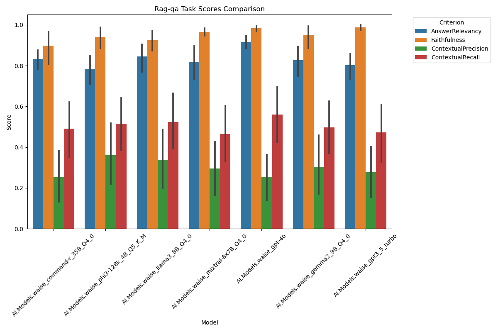
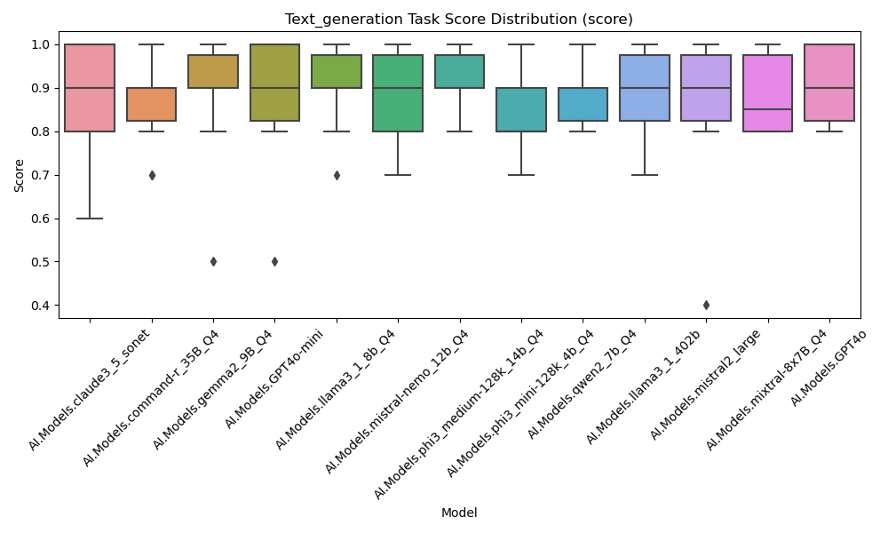

# The LLM AI Evaluation Framework

The LLM AI Evaluation Framework is a comprehensive tool designed to evaluate the performance and suitability of different Large Language Models (LLMs) for specific tasks in the context of knowledge management and XWiki technical support. The framework aims to provide insights into the capabilities of LLMs in generating typical content, summarizing content, and answering questions based on provided context.

The evaluation framework is using Snakemake, a workflow management system, for the execution of piplelinds or individual steps. It integrates with the LLM Application's API to index and retrieve data, and utilizes various evaluation scripts to assess the performance of the LLMs on different tasks.

## Current evaluated tasks:

- generating typical content
- content summarization
- question answering (based on provided context)
- language consistency

## Key Features

- Evaluation of LLMs for knowledge management and XWiki technical support tasks
- Support for multiple tasks, including text generation, content summarization, and question answering (RAG-QA)
- Integration with the LLM application API for data indexing and retrieval
- Customizable input and configuration files to adapt the evaluation to specific needs
- Snakemake workflow for easy execution of data preparation and the evaluation pipeline
- Evaluation scripts for each task to assess the performance of the LLMs
- Visualization of evaluation results through generated plots and a PDF report

## Workflow

The LLM AI Evaluation Framework follows a structured workflow to evaluate the performance of LLMs:
- **Prepare evaluation data**: Download documents from an XWiki instance like xwiki.org and save them in the _context_data_ directory.
- **Data Indexing**: The framework indexes the data using the LLM Application's API, reading collection and document JSON files from the _context_data_ directory.
- **Model setup (manual step)**: After the collections have been indexed, the models have to be setup manually in the LLM Application. Make sure the models declared in the config.json file exist in your LLM Application and have access to the evaluation data indexed previously.
- **Model Response Collection**: The framework sends request to the models and collects the responses based on the task settings in the configuration file.
- **Evaluation**: The generated outputs for each task (text generation, content summarization, RAG-QA) are evaluated using specific evaluation scripts.
- **Visualization**: The evaluation results are visualized through generated plots to provide insights into the performance of the LLMs, centralized in the Evaluation_report.pdf

The framework is designed to be flexible and customizable, allowing users to adapt the evaluation to their specific needs by modifying the input and configuration files. It provides a comprehensive set of tools and scripts to assess the suitability of LLMs for knowledge management and XWiki technical support tasks.

Read more about the [Evaluation Metodolog](https://design.xwiki.org/xwiki/bin/view/Proposal/X-AI/WAISE/Evaluation%20Methodology/).

## Installation

To use the LLM AI Evaluation framework, follow these steps:

1. Clone the repository:

```
git clone https://github.com/xwiki-contrib/ai-llm-benchmark.git
```

2. Navigate to the project directory:

```
cd ai-llm-benchmark
```

3. Create and activate the Conda environment:

```
conda env create -f environment.yml
conda activate eval
```

4. Rename _example.env_ to _.env_ and update the variables for connecting to your XWiki instance. The BASE_URL needs to point to the _rest/wikis/{wikiName}/aiLLM_ endpoint of the LLM Application.


## Usage

1. Download data from an XWiki instance and save them in the _context_data_ directory to be used as evaluation context or simply use the default data extracted from xwiki.org.

```
snakemake --cores 1 download
```

Optional: Translate context data into French and German

```
snakemake -c 1 translate_to_french
snakemake -c 1 translate_to_german
```

2. Customize the _input/input.json_ according to your needs.
Current supported task: text_generation, summarization, RAG-qa

Example of _input.json_ format:

```json
{
    "tasks": {
        "text_generation": [
                {
                    "id": "text_gen_001",
                    "prompt": "Extract the key information (name, date of birth, address) from the following text:\n\nJohn Doe, born on 15th August 1990, currently resides at 123 Main Street, Anytown, USA.",
                    "expected_answer": "{\n \"name\": \"John Doe\",\n \"date_of_birth\": \"15th August 1990\",\n \"address\": \"123 Main Street, Anytown, USA\"\n}",
                    "data_path": null
                },
                {
                    "id": "text_gen_002",
                    "prompt": "Transform the following keywords into a coherent sentence:\n\ncat, playful, garden, sunny day",
                    "expected_answer": "On a sunny day, the playful cat enjoyed exploring the garden.",
                    "data_path": null
                }
            ],
            "summarization": [
                {
                    "id": "summ_001",
                    "data_path": "../context_data/documents/xwiki_Documentation.UserGuide.GettingStarted.XWikiBasicConcepts.json"
                },
                {
                    "id": "summ_002",
                    "data_path": "../context_data/documents/xwiki_Documentation.AdminGuide.Access Rights.Permission types.WebHome.json"
                }
            ],
            "RAG-qa": [
                {
                    "id": "qa_001",
                    "prompt": "The \"Bell\" in the top right corner is not available, also not when the \"Alert Notification\" extension is installed.",
                    "expected_answer": "Make sure that notifications are enabled in your wiki. You can enable them by setting the `notifications.enabled` setting in `xwiki.properties` to `true`.",
                    "data_path": null
                }
        ]
    }
}
```

3. Index the evaluation data to your LLM Application instance:

```
snakemake --cores 1 index
```

4. Setup your the _config.json_ based on the models in your LLM Application instance,
and make sure the models used for RAG-qa evaluation have access to the indexed evaluation collections. (collection ids provided by default are: Eval, Eval_fr, Eval_de)

Example of _config.json_:

```json
{
    "evaluator": {
        "model": "AI.Models.GPT-4o",
        "temperature": 0.5,
        "stream": false
    },
    "tasks": [
        {
            "task": "RAG-qa",
            "settings": {
            "model": "AI.Models.waise-gpt-4o",
            "temperature": 0.3,
            "stream": false
        }
        },
        {
            "task": "RAG-qa",
            "settings": {
            "model": "AI.Models.waise-mixtral",
            "temperature": 0.3,
            "stream": false
        }
        },
        {
            "task": "text_generation",
            "settings": {
            "model": "AI.Models.mixtral",
            "temperature": 0.8,
            "stream": false
        }
        }
    ]
}
```

5. Run the evaluation pipeline with snakemake

```
snakemake --cores 1 evaluate
```

6. Generate the evaluation report

```
snakemake --cores 1 report
```

## Running individual steps

Snakemake allows us to run the entire pipeline or run individual rules.

### Downloadin context data

This step downloads the context data from an XWiki instance. It reads the list of URLs from input/urls.txt file, downloads and formats the data from the specified URLs to be used as evaluation context.
The data is saved in the _context_data/documents_ directory.

To run this step, use the following command:

```
snakemake -c 1 download
```

### Index data

This step indexes the data using the LLM Application API. It reads the collection and document JSON files from the specified directories and indexes them in the LLM Application on the XWiki instance, by default under the collection named Eval (Eval_de and Eval_fr).

To run this step, use the following command:

```
snakemake --cores 1 index
```

### Split input to files

This step splits the input JSON file into separate task files. It reads the input file and creates individual JSON files for each task in the specified output directory.

To run this step individually, use the following command:

```
snakemake --cores 1 split
```

### Collect model responses

This step collects the model responses for each task. It reads the task files from the specified input directory, sends requests to the LLM Application API based on the task settings in the configuration file, and saves the model responses in the _output_ directory.

To run this step, use the following command:

```
snakemake --cores 1 collect
```

### Evaluate summaries

This step evaluates the generated summaries using the eval_summary.py script. It reads the model outputs, evaluates the summaries using the _SummarizationMetric_ metric provided by the DeepEval library, and saves the evaluation results in the _evaluation_results_ directory.

To run this step individually, use the following command:

```
snakemake --cores 1 eval_summary
```

### Evaluate text generation

This step evaluates the generated text using the eval_text_generation.py script. It reads the model outputs, evaluates the generated text using the _GEval_ metric with customized criteria provided by the DeepEval library, and saves the evaluation results in the _evaluation_results_ directory.

To run this step individually, use the following command:

```
snakemake --cores 1 eval_text_generation
```

### Evaluate RAG-QA

This step evaluates the RAG-QA (Retrieval Augmented Generation Question Answering) task using the eval_rag_qa.py script. It reads the model outputs, evaluates the RAG-QA task using the average of four distinct metrics (RAGASAnswerRelevancyMetric, RAGASFaithfulnessMetric, RAGASContextualPrecisionMetric, RAGASContextualRecallMetric) provided by the DeepEval library, and saves the evaluation results in the _evaluation_results_ directory.

To run this step individually, use the following command:

```
snakemake --cores 1 eval_rag_qa
```

### Generate plots

This step creates plots for visualizing the evaluation results. It reads the evaluation results, generates plots based on the configuration file, and saves the plots in the _evaluation_results_graphcs_ directory.

To run this step individually, use the following command:

```
snakemake --cores 1 generate_plots
```

### Generate report

This step generates a pdf report containing evaluation data and plots.

```
snakemake --cores 1 generate_report
```

### Clean

This step cleans up all the generated files and directories. It removes the evaluation results directory, tasks directory, output directory, and the snakeout directory.


To run this step individually, use the following command:

```
snakemake --cores 1 clean
```

---






---

* Project Lead: Ludovic Dubost 
* [Issue Tracker](https://jira.xwiki.org/browse/LLMAI)
* Communication: [Forum](https://forum.xwiki.org/), [Chat](https://dev.xwiki.org/xwiki/bin/view/Community/Chat)
* License: LGPL 2.1
* Translations: N/A
* Sonar Dashboard: N/A
* Continuous Integration Status: N/A
